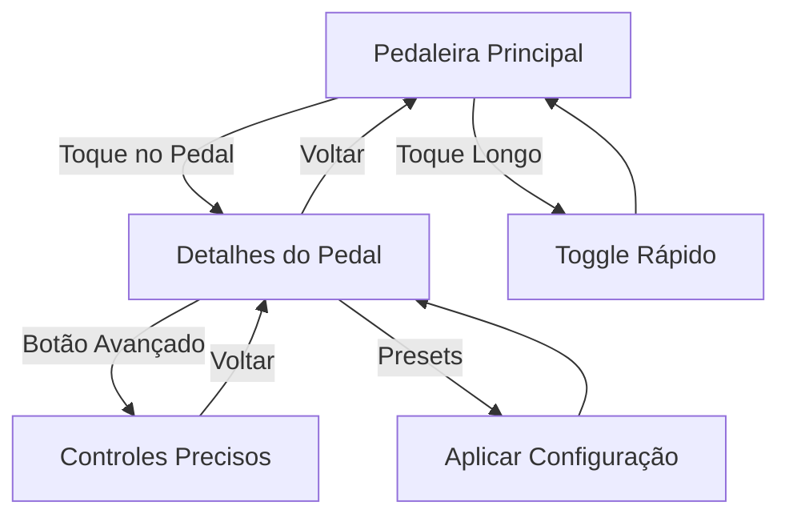

# 🎸 **Nova Interface Moderna - ToneForge**

## **Visão Geral**

A nova interface do ToneForge foi completamente reimaginada em **três níveis de interação**, proporcionando desde controle rápido até ajuste preciso de parâmetros.

---

## **🏗️ Arquitetura das Três Interfaces**

### **Nível 1: Pedaleira Principal (Tela de Visão Geral)**
**Arquivo:** `fragment_pedalboard_modern.xml`

**Características:**
- **Grid 2x5** de pedais visuais
- **Toque rápido** no pedal → Abre tela de detalhes
- **Toque longo** → Toggle liga/desliga
- **Drag & Drop** para reordenar
- **Visualização da cadeia de sinal**
- **Monitoramento de performance** (CPU, latência)

**Componentes:**
- Header moderno com controles principais
- Grid responsivo de pedais
- Cadeia de sinal horizontal
- Footer com informações de status

---

### **Nível 2: Pedal Individual (Tela de Controle Visual)**
**Arquivo:** `activity_pedal_detail.xml`

**Características:**
- **Visual realista** do pedal físico (280x400dp)
- **3 knobs interativos** (1 principal + 2 secundários)
- **LEDs de status** (power/clipping)
- **Switch on/off** realista
- **Presets rápidos** (Clean, Crunch, Heavy)
- **Controles avançados** expandíveis

**Componentes:**
- CardView com visual metálico
- Knobs com `RealisticKnob` customizado
- LEDs animados
- Seção de presets
- Integração com AudioEngine

---

### **Nível 3: Controles Avançados (Tela de Parâmetros Precisos)**
**Arquivo:** `fragment_advanced_controls.xml`

**Características:**
- **Sliders precisos** para cada parâmetro
- **Valores numéricos** em tempo real
- **Switches** para características específicas
- **Botões de reset** individuais
- **Feedback visual** imediato

**Componentes:**
- Cards por categoria de efeito
- SeekBars com valores percentuais
- Switches para opções booleanas
- Headers com status do sistema

---

## **🎛️ Componentes Principais**

### **RealisticKnob (Widget Customizado)**
```java
public class RealisticKnob extends View {
    // Gradiente radial metálico
    // Indicador de posição rotativo
    // Marcações de referência
    // Interação por touch/drag
    // Callbacks para mudanças
}
```

**Características:**
- **Visual 3D** com sombras e highlights
- **Rotação 270°** (135° a 405°)
- **Feedback tátil** durante interação
- **Valores 0-100%** com precisão

---

### **PedalEffect (Modelo Atualizado)**
```java
public class PedalEffect {
    // Campos básicos
    private String name, type, category;
    private String subtitle, color;
    private boolean enabled;
    private int position;
    
    // Knobs (valores 0-100)
    private float mainKnobValue;
    private float secondaryKnob1Value;
    private float secondaryKnob2Value;
    
    // Labels customizáveis
    private String mainKnobLabel;
    private String secondaryKnob1Label;
    private String secondaryKnob2Label;
}
```

---

### **PedalDetailActivity (Controlador Principal)**
```java
public class PedalDetailActivity extends AppCompatActivity {
    // Configuração dinâmica por tipo de pedal
    // Integração com AudioEngine
    // Presets rápidos predefinidos
    // Animações de entrada/saída
    // Retorno de configurações modificadas
}
```

---

## **🎨 Sistema Visual**

### **Cores por Categoria**
- **Distortion:** `#DC2626` (Vermelho)
- **Modulation:** `#2563EB` (Azul)
- **Time:** `#059669` (Verde)
- **Filter:** `#CA8A04` (Amarelo)
- **Dynamics:** `#7C3AED` (Roxo)
- **Ambient:** `#4F46E5` (Índigo)

### **LEDs de Status**
- **Power On:** Verde `#00FF88`
- **Power Off:** Cinza `#404040`
- **Clipping:** Vermelho `#FF3333`
- **Inactive:** Cinza escuro `#333333`

### **Gradientes**
- **Header:** `#2A2A2A → #151515`
- **Background:** `#0F0F0F → #1A1A1A → #0A0A0A`
- **Pedal:** Efeito metálico multicamada

---

## **🔄 Fluxo de Navegação**



---

## **⚡ Integração com AudioEngine**

### **Mapeamento de Efeitos**
```java
// Exemplo para Distortion
switch (pedalType) {
    case "distortion":
        audioEngine.setDistortionAmount(mainKnobValue);
        audioEngine.setDistortionTone(secondaryKnob1Value);
        audioEngine.setDistortionLevel(secondaryKnob2Value);
        audioEngine.setDistortionEnabled(enabled);
        break;
}
```

### **Ordem dos Efeitos**
- Aplicação automática da ordem visual
- Reordenação por drag & drop
- Atualização em tempo real

---

## **📱 Recursos Modernos**

### **Animações**
- **Entrada suave** dos pedais (scale + alpha)
- **LEDs pulsantes** durante mudanças
- **Transições fluidas** entre telas
- **Feedback visual** em interações

### **Gestos**
- **Toque simples:** Abrir detalhes
- **Toque longo:** Toggle rápido
- **Drag:** Reordenar pedais
- **Swipe:** Navegação (futuro)

### **Feedback**
- **Toasts informativos**
- **LEDs de status**
- **Tooltips contextuais**
- **Indicadores de performance**

---

## **🎯 Benefícios da Nova Interface**

### **Para Músicos**
✅ **Familiaridade** - Visual similar a pedaleiras reais  
✅ **Eficiência** - Acesso rápido e controle preciso  
✅ **Flexibilidade** - Três níveis de controle  
✅ **Feedback** - Visual imediato das mudanças  

### **Para Desenvolvimento**
✅ **Modularidade** - Componentes reutilizáveis  
✅ **Escalabilidade** - Fácil adição de novos efeitos  
✅ **Manutenibilidade** - Código organizado e documentado  
✅ **Performance** - Otimizado para tempo real  

---

## **📁 Arquivos Criados/Modificados**

### **Layouts**
- `fragment_pedalboard_modern.xml` - Pedaleira principal
- `activity_pedal_detail.xml` - Tela individual do pedal
- `fragment_advanced_controls.xml` - Controles avançados

### **Classes Java**
- `RealisticKnob.java` - Widget de knob customizado
- `PedalDetailActivity.java` - Activity de detalhes
- Atualizações em `PedalEffect.java` e `PedalboardFragment.java`

### **Recursos Visuais (13 novos drawables)**
- `pedalboard_modern_background.xml`
- `realistic_pedal_background.xml`
- `led_power_active/inactive.xml`
- `led_clipping_active/inactive.xml`
- `realistic_switch_thumb/track.xml`
- `modern_header_gradient.xml`
- `status_pill_background.xml`
- `ic_arrow_back.xml`

---

## **🚀 Próximos Passos**

1. **Testes** - Validação da usabilidade
2. **Otimização** - Performance dos knobs
3. **Personalização** - Temas e cores
4. **Presets** - Sistema completo de salvamento
5. **Compartilhamento** - Export/import de configurações

---

*Interface criada para proporcionar a melhor experiência de controle de efeitos de guitarra em dispositivos móveis.* 