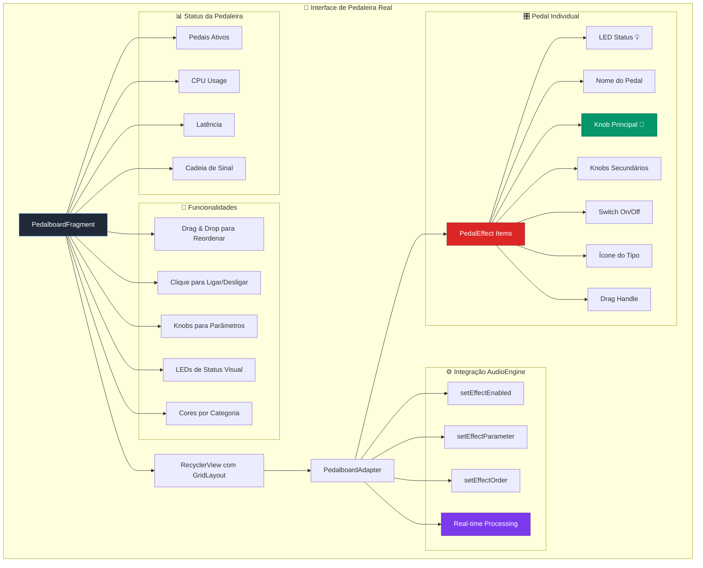

# 🎸 Interface de Pedaleira Real - Arquitetura e Documentação

## 📋 **Visão Geral**

A interface de pedaleira do ToneForge foi projetada para oferecer uma experiência autêntica e familiar para músicos, replicando visualmente e funcionalmente uma pedaleira real. Cada efeito é representado como um pedal físico com controles intuitivos.

## 🏗️ **Diagrama da Arquitetura**



## 🎯 **Componentes Principais**

### **1. PedalboardFragment**
- **Localização:** `app/src/main/java/com/thiagofernendorech/toneforge/PedalboardFragment.java`
- **Função:** Controlador principal da interface de pedaleira
- **Responsabilidades:**
  - Gerenciamento do ciclo de vida
  - Coordenação entre adapter e AudioEngine
  - Atualização de status em tempo real
  - Manipulação de eventos de usuário

### **2. PedalEffect**
- **Localização:** `app/src/main/java/com/thiagofernendorech/toneforge/PedalEffect.java`
- **Função:** Modelo de dados que representa um pedal
- **Características:**
  - Knob principal + até 2 knobs secundários
  - Estado on/off
  - Categoria e cor automática
  - Factory methods para criação de pedais específicos

### **3. PedalboardAdapter**
- **Localização:** `app/src/main/java/com/thiagofernendorech/toneforge/PedalboardAdapter.java`
- **Função:** Gerencia a lista de pedais no RecyclerView
- **Funcionalidades:**
  - Drag & drop para reordenação
  - Binding de dados para views
  - Callbacks para interações do usuário

## 🎨 **Design Visual**

### **Layout de Pedal Individual**
```xml
<!-- app/src/main/res/layout/pedal_effect_item.xml -->
- CardView (160x220dp) com elevação
- LED de status (12x12dp)
- Nome do efeito (letras maiúsculas)
- Knob principal (80x80dp)
- Knobs secundários (40x40dp)
- Switch on/off
- Ícone do tipo de efeito
- Handle para drag & drop
```

### **Recursos Visuais**
- **LEDs:** Verde (ligado) / Cinza (desligado)
- **Knobs:** Circulares com gradiente metálico
- **Background:** Gradiente escuro simulando metal
- **Switches:** Design realista com estados visuais
- **Cores por Categoria:**
  - 🔴 Distortion: `#FFDC2626`
  - 🔵 Modulation: `#FF2563EB`
  - 🟢 Time: `#FF059669`
  - 🟡 Filter: `#FFCA8A04`
  - 🟣 Dynamics: `#FF7C3AED`
  - 🟦 Ambient: `#FF4F46E5`

## ⚙️ **Integração com AudioEngine**

### **Mapeamento de Controles**
```java
// Ativação/Desativação
AudioEngine.setGainEnabled(boolean)
AudioEngine.setDistortionEnabled(boolean)
AudioEngine.setDelayEnabled(boolean)
// ... outros efeitos

// Parâmetros
AudioEngine.setGainLevel(float)
AudioEngine.setDistortionLevel(float)
AudioEngine.setDelayTime(float)
// ... outros parâmetros

// Ordem dos Efeitos
AudioEngine.setEffectOrder(String[])
```

### **Tratamento de Parâmetros Especiais**
```java
// EQ com mapeamento para bandas específicas
if (value < 0.33f) {
    AudioEngine.setEQLow(value * 3.0f);
} else if (value < 0.66f) {
    AudioEngine.setEQMid((value - 0.33f) * 3.0f);
} else {
    AudioEngine.setEQHigh((value - 0.66f) * 3.0f);
}
```

## 🔧 **Funcionalidades de Usuário**

### **1. Drag & Drop para Reordenar**
- **Implementação:** ItemTouchHelper com GridLayoutManager
- **Direções:** UP, DOWN, LEFT, RIGHT
- **Feedback:** Visual em tempo real
- **Persistência:** Automática via AudioEngine

### **2. Controles Interativos**
- **Clique no Pedal:** Liga/desliga o efeito
- **Long Press:** Exibe tooltip com informações
- **Knobs:** Controle de parâmetros em tempo real
- **Switch:** Alternativa ao clique para on/off

### **3. Feedback Visual**
- **LEDs:** Status imediato de cada pedal
- **Cadeia de Sinal:** Visualização horizontal dos efeitos ativos
- **Cores:** Identificação por categoria
- **Animações:** Transições suaves

## 📊 **Monitoramento de Performance**

### **Métricas Exibidas**
- **Pedais Ativos:** Contagem em tempo real
- **CPU Usage:** Estimativa baseada em pedais ativos
- **Latência:** Cálculo baseado na cadeia de efeitos
- **Status Pipeline:** Indicador de funcionamento

### **Cálculos**
```java
// CPU Usage: 5% por pedal ativo
int cpuUsagePercent = activePedals * 5;

// Latência: 2ms base + 0.5ms por pedal
int latencyMs = 2 + (activePedals / 2);
```

## 🎛️ **Pedais Disponíveis**

### **Dynamics**
1. **Gain** - Controle de ganho de entrada
2. **Compressor** - Ratio, Attack, Release

### **Distortion**
3. **Overdrive** - Drive, Tone, Level
4. **Distortion** - Dist, Tone, Level

### **Modulation**
5. **Chorus** - Depth, Rate, Mix
6. **Flanger** - Depth, Rate, Feedback
7. **Phaser** - Depth, Rate, Feedback

### **Filter**
8. **EQ** - Freq, Gain, Q

### **Time**
9. **Delay** - Time, Feedback, Mix
10. **Reverb** - Room, Damping, Mix

## 🚀 **Navegação e Integração**

### **Acesso à Interface**
- **Botão:** Ícone 🎛️ no header principal
- **Localização:** Entre botão Home e título
- **Cor:** Roxo (`lava_purple`) para destaque

### **Integração no MainActivity**
```java
// Navegação
findViewById(R.id.btnPedalboard).setOnClickListener(v -> {
    loadFragment(new PedalboardFragment());
    updateHeaderTitle("🎸 Pedaleira");
});

// Título automático
if (fragment instanceof PedalboardFragment) {
    updateHeaderTitle("🎸 Pedaleira");
}
```

## 📱 **Layout Responsivo**

### **Grid Configuration**
- **Colunas:** 2 em portrait
- **Espaçamento:** 8dp entre pedais
- **Scroll:** Vertical com NestedScrollView
- **Performance:** RecyclerView com ViewHolder pattern

### **Informações de Status**
- **Header:** Título + botões de controle
- **Status Bar:** Pipeline ativo/inativo
- **Footer:** Informações de versão + preset atual

## 🔄 **Ciclo de Vida**

### **onCreate**
1. Inicialização de views
2. Criação da lista de pedais padrão
3. Configuração do RecyclerView
4. Setup de drag & drop
5. Configuração de botões

### **onResume**
- Iniciar pipeline de áudio
- Atualizar status da pedaleira

### **onDestroy**
- Parar pipeline de áudio
- Limpar recursos

## 📝 **Arquivos Criados/Modificados**

### **Novos Arquivos**
```
app/src/main/res/layout/pedal_effect_item.xml
app/src/main/res/layout/fragment_pedalboard.xml
app/src/main/java/com/thiagofernendorech/toneforge/PedalEffect.java
app/src/main/java/com/thiagofernendorech/toneforge/PedalboardAdapter.java
app/src/main/java/com/thiagofernendorech/toneforge/PedalboardFragment.java

Drawables (13 arquivos):
- pedal_background.xml
- knob_background.xml / knob_progress.xml / knob_thumb.xml
- knob_small_* (versões menores)
- ic_led_on.xml / ic_led_off.xml
- pedal_switch_thumb.xml / pedal_switch_track.xml
- drag_handle_background.xml
- pedalboard_*.xml (backgrounds diversos)
```

### **Arquivos Modificados**
```
app/src/main/java/com/thiagofernendorech/toneforge/MainActivity.java
- Adição do botão pedaleira
- Integração na navegação
- Título automático

app/src/main/res/layout/activity_main.xml
- Botão pedalboard no header
```

## 🎯 **Benefícios da Implementação**

### **Para o Usuário**
- ✅ Interface familiar para músicos
- ✅ Controles intuitivos tipo hardware
- ✅ Feedback visual imediato
- ✅ Reordenação fácil por drag & drop
- ✅ Monitoramento de performance

### **Para o Desenvolvimento**
- ✅ Código modular e bem estruturado
- ✅ Separação clara de responsabilidades
- ✅ Fácil adição de novos efeitos
- ✅ Integração seamless com AudioEngine
- ✅ Performance otimizada

### **Para a Experiência**
- ✅ Look & feel profissional
- ✅ Redução da curva de aprendizado
- ✅ Maior satisfação do usuário
- ✅ Diferencial competitivo
- ✅ Versatilidade de uso

---

**Documentação criada em:** Dezembro 2024  
**Versão:** 1.0  
**Status:** Implementado e funcional 🎸✨ 